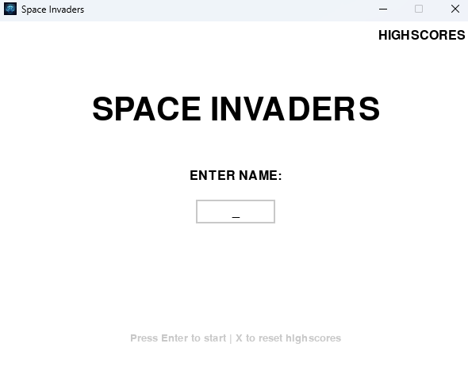
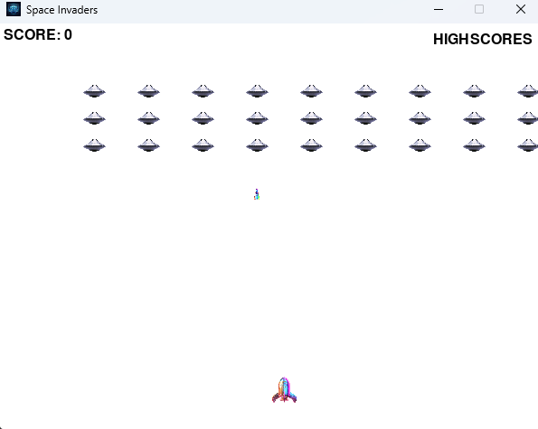

# Space Invaders

A modern, modular Python remake of the classic arcade shooter. This game uses `pygame` for rendering, input handling, and audio playback, while maintaining a professional architecture with a clean separation of game logic, rendering, and configuration.

## Features

- Player-controlled spaceship with left/right movement and shooting
- Multiple alien enemies with movement and collision detection
- Alien bullets, player bullets, and win/lose conditions
- Highscore persistence using JSON storage
- Start screen with name input and highscore display
- Modular architecture with one class per file for clean, maintainable code

## Structure

This project uses a strict modular layout under the `SBS/` package. Each class is defined in its own file, and shared constants are centralized in `SBS/constants.py`.

## Screenshots

Add your screenshots here as image links. Example:

- `assets/screscreenshot-start.png`
- `assets/screenshot-gameplay.png`
- `assets/screenshot-gameover.png`

```markdown



```

## Setup & Execution

1. Install Python 3.10+.
2. Install dependencies:

```bash
pip install pygame
```

3. Run the game from the project root:

```bash
python SpaceInvaders_main.py
```

## Development Note

This project was developed, polished, and refactored with the assistance of Artificial Intelligence.
